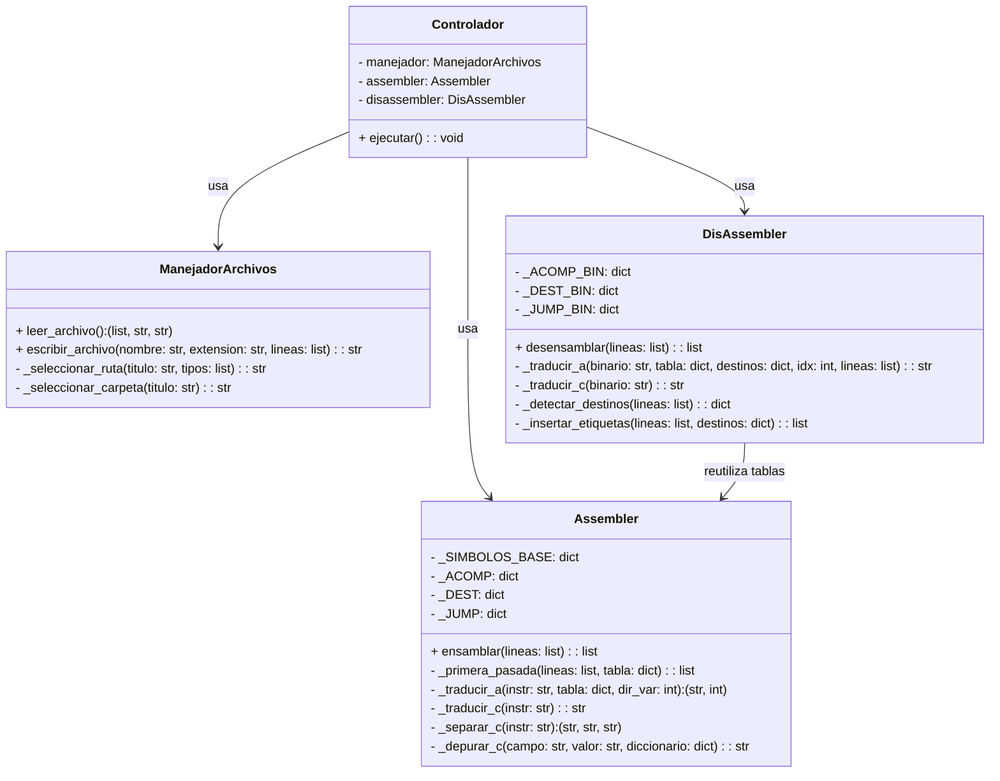

# Diagrama de Clases

```mermaid
classDiagram

class ManejadorArchivos {
    + leer_archivo(): (list, str, str)
    + escribir_archivo(nombre: str, extension: str, lineas: list): str
    - _seleccionar_ruta(titulo: str, tipos: list): str
    - _seleccionar_carpeta(titulo: str): str
}

class Assembler {
    - _SIMBOLOS_BASE: dict
    - _ACOMP: dict
    - _DEST: dict
    - _JUMP: dict
    + ensamblar(lineas: list): list
    - _primera_pasada(lineas: list, tabla: dict): list
    - _traducir_a(instr: str, tabla: dict, dir_var: int): (str, int)
    - _traducir_c(instr: str): str
    - _separar_c(instr: str): (str, str, str)
    - _depurar_c(campo: str, valor: str, diccionario: dict): str
}

class DisAssembler {
    - _ACOMP_BIN: dict
    - _DEST_BIN: dict
    - _JUMP_BIN: dict
    + desensamblar(lineas: list): list
    - _traducir_a(binario: str, tabla: dict, destinos: dict, idx: int, lineas: list): str
    - _traducir_c(binario: str): str
    - _detectar_destinos(lineas: list): dict
    - _insertar_etiquetas(lineas: list, destinos: dict): list
}

class Controlador {
    - manejador: ManejadorArchivos
    - assembler: Assembler
    - disassembler: DisAssembler
    + ejecutar(): void
}

Controlador --> ManejadorArchivos : usa
Controlador --> Assembler : usa
Controlador --> DisAssembler : usa
DisAssembler --> Assembler : reutiliza tablas
```